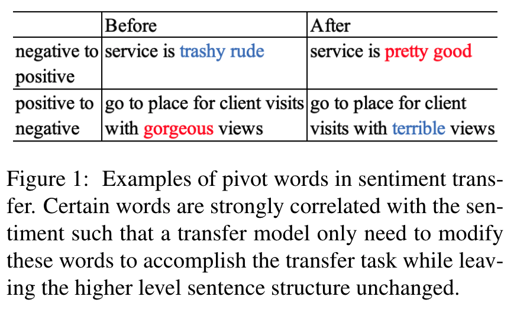

# The Pivot Analysis

The implementation of paper Yao fu, Hao Zhou, Jiaze Chen, and Lei Li, _Rethinking Text Attribute Transfer: A Lexical Analysis_. INLG 2019. 

The **pivot word discovery, the pivot classifier**, and **the precision-recall histogram** are implemented in thie repo. 

The pivot analysis discoverys words strongly influence sentence classification, and show which words to modify in order to change the style of the sentence. 



## Download the data 
The datasets used in the paper are:
* yelp 
* amazon 
* caption 
* gender 
* paper 
* politics 
* reddit 
* twitter

All organized as: train.0, train.1/ dev.0, dev.1/ test.0, test.1. Download from [here](https://drive.google.com/open?id=1ZtDIfHKc_GhNElRwHdDvk7tiCkv5_wJa)

But note that the caption dataset does not have the right test data (because they made a mistake [in their release](https://github.com/lijuncen/Sentiment-and-Style-Transfer), the positive and negative sentences in the test seet are the same). 

Other data are from the corresponding papers, with renaming and re-organization to fit our code. 

## Run it 

```bash
mkdir outputs
python main.py --dataset=yelp --pivot_thres_cnt=1 --prec_thres=0.5 --recl_thres=0.0
```

and the outputs would something like:

```bash
...
Pivot word discovery:
class 0, 4929 pivots, pivot recall: 0.3348
class 1, 4129 pivots, pivot recall: 0.3435
...
Pivot classifier:
train accuracy: 0.8401
dev accuracy: 0.8313
test accuracy: 0.8333
...
output stored in
../outputs/yelp_1.pivot
```

Sample outputs 
```bash
yelp_0.pivot: word/ precision/ recall (negative sentiment)
sadly			0.9924	0.0002
mistaken			0.7778	0.0000
general			0.6285	0.0001
run			0.6795	0.0003
mill			0.6226	0.0000

yelp_1.pivot: word/ precision/ recall (positive sentiment)
hoagies			0.7903	0.0000
italian			0.7029	0.0004
ton			0.7260	0.0001
really			0.5998	0.0038
worthy			0.6548	0.0000

yelp_0.sent: (pivot words are annotated with their precision)
ok(0.927) never(0.897) going(0.680) back(0.616) to this place again .
easter(0.786) day(0.502) nothing(0.918) open(0.516) , heard(0.778) about this place figured(0.781) it would ok(0.927) .

yelp_1.sent: (pivot words are annotated with their precision)
staff(0.791) behind the deli(0.696) counter were super(0.845) nice(0.907) and efficient(0.943) !
the staff(0.791) are always(0.918) very nice(0.907) and helpful(0.890) .
```

Parameters tunning:

`prec_thres` gives the confidence of how a word may determine the classification. To find strong pivot words, increase this parameter (e.g. [0.7, 1.0]). To achieve better classification performance, decrease this parameter (e.g. [0.5, 0.7])

`recl_thres` and `pivot_thres_cnt` prevents overfitting on single words. To increase confidence of the pivot words, increase them; to increase classification performance, decrease them.  


## Contact 
Yao Fu, yao.fu@columbia.edu